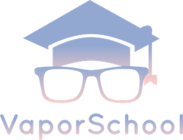

   
  
   
   

With VaporSchool it doesn't matter how experienced you are. Be it you just started with Vapor or already implemented some apps. I want to help you to get to the next level!

> Each project focuses on a specific topic and has a tutorial written on medium to help you *understand* it! 😊
- ### Beginner
  - [My First Route](https://github.com/vaporberlin/my-first-route)
  - [My First Leaf-Template](https://github.com/vaporberlin/my-first-leaf-template)
  - [My First Model](https://github.com/vaporberlin/my-first-model)
  - [My First Controller](https://github.com/vaporberlin/my-first-controller)
  - [My First CRUD using Leaf](https://github.com/vaporberlin/my-first-crud-using-leaf)
- ### Advanced
- ### Expert
